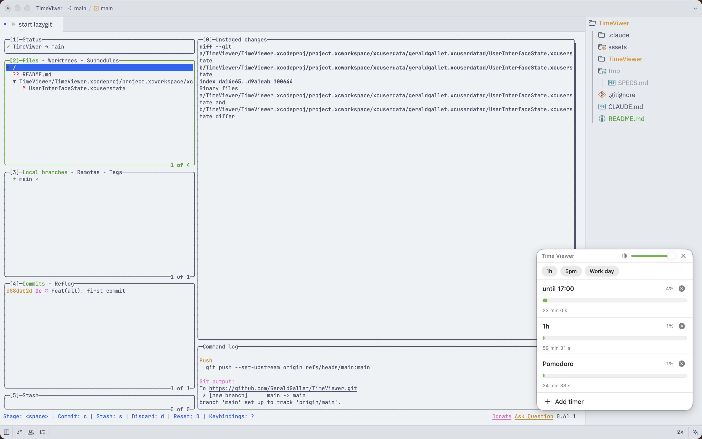
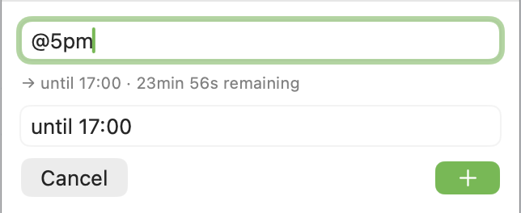

# Time Viewer

A macOS menubar app for running several countdown timers at once. It lives in
the menubar and can optionally show a floating widget that stays above all other
windows.

## Why ?
- Because I wanted to find an application that lets me visualize time, and how much remains in comparison to how much I had (the percentages), but didn't find quite what I wanted.
- Because I had some remaining tokens on my sessions, and figured it would be a waste to just stop there and go to sleep.

## Disclaimer
I've never developed anything in Swift, and have read myself the grand number of 0 file.

I just wanted to try MacOS application development, seeing what is possible, after not managing to find the _exact_ application I had in mind.

## What it does

- **Multiple timers at once.** Run as many countdowns side by side as you like,
  each with its own name and progress bar.
- **Two ways to set a timer:**
  - A **duration**, e.g. `1h`, `30m`, `90s`, or combinations like `1h 30m`.
  - A **target time**, prefixed with `@`, e.g. `@5pm`, `@17:00`, `@9am`. If the
    time has already passed today, it rolls over to tomorrow.
  As you type, a live preview shows what will be created (e.g.
  `→ until 17:00 · 23min 56s remaining`).
- **Presets.** One-tap chips for the timers you start often. Ships with `1h` and
  `5pm`, and you can add, rename, or remove your own from Settings.
- **Floating widget.** A compact panel pinned to the top-right of the screen,
  floating above every other window so your timers stay visible while you work.
  Its opacity is adjustable.
- **Notifications.** A system notification (with sound) fires when a timer
  reaches zero.
- **Menubar native.** Runs as a menubar-only accessory app — no Dock icon, no
  app window cluttering your space.

## Screenshots

The floating widget, pinned above another full-screen app:



Adding a timer by target time, with live preview:



Preset chips for quick starts:


## Input formats

| You type    | You get                                              |
| ----------- | ---------------------------------------------------- |
| `1h`        | A 1-hour countdown                                   |
| `30m`       | A 30-minute countdown                                |
| `90s`       | A 90-second countdown                                |
| `1h 30m`    | A 1-hour-30-minute countdown                         |
| `@5pm`      | Counts down until 17:00 (today, or tomorrow if past) |
| `@17:00`    | Same as above, 24-hour notation                      |
| `@9am`      | Counts down until 09:00                              |

A bare number with no unit is read as minutes (`5` → 5 minutes).

## Requirements

- macOS 13 (Ventura) or later — uses `MenuBarExtra`.
- No external dependencies.

## Build and run

```bash
xcodebuild -scheme TimeViewer -configuration Debug build
open build/Debug/TimeViewer.app
```

Or open `TimeViewer.xcodeproj` in Xcode and hit Run.

## Tech

Swift and SwiftUI, no third-party libraries. Shared state lives in
`ObservableObject` stores (`TimerStore`, `PresetStore`, `WidgetSettings`)
injected through the environment. Presets and widget opacity persist via
`UserDefaults`; the timers themselves are in-memory.

100% code made with (by) Claude Code.
